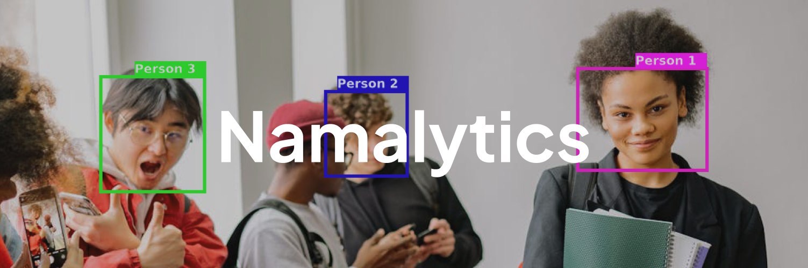

<div align=center>
  <h1><b>Namalytics</b></h1>
</div>



<div align=center>
  Transforming Data into Recognition.
</div>

## What's this?

<p align=justify>Namalytics is an amazing app that was created as a final project for the Computer Vision course. It's not just about doing an assignment, it's also a great opportunity to have some fun in the world of technology and to improve my portfolio!</p>

## Main goals

<p align=justify>It's a simple yet crucial feature that enhances the efficiency of student identification processes within the campus environment. With the help of cutting-edge object detection technology, this application can ensure that every registered student's identity is accurately recognized and validated in real time.</p>

## Collabolators

<p align=justify>This project would not have been completed without the contributions of our campus friends, thanks to:</p>

| No  | Name               | Job               |
| --- | ------------------ | ----------------- |
| 1   | Rama Adityo        | Programmer        |
| 2   | M. Arya Yudhistira | Dataset Collector |

## Tech Stacks

To keep this app running smoothly, we use a few different technologies. Some of them are:

<ol><li align=justify><p>Streamlit</p>This is the foundation for creating and managing web app of Python, or the look and feel of the application. With Streamlit, we can build an interface that is straightforward but stylish enough for users. The app works great, and it's also visually appealing!</li><li align=justify><p>YOLO algorithm</p>YOLO is a state-of-the-art object detection algorithm known for its speed and accuracy. Leveraging YOLO, the application can quickly and reliably identify registered students from live video feeds, ensuring seamless performance even in dynamic campus environments.</li><li align=justify><p>OpenCV</p>OpenCV helps in pre-processing and analyzing video feeds to enhance the accuracy of the detection system. From capturing real-time frames to integrating with YOLO, OpenCV ensures good image handling, enabling the application to maintain consistent and reliable results in real-time student identification.</li></ol>

## Installation

To use this application, you need to do a few things to make it work:

#### 1. Clone this repository

```bash
git clone https://github.com/ramadityo/namalytics.git
```

#### 2. Add python env to the app folder

For Windows:

```bash
py -m venv .venv
```

```bash
.venv\Scripts\activate
```

For Linux

```bash
python3 -m venv .venv
```

```bash
source .venv/bin/activate
```

#### 3. Install libraries from requirements.txt

```bash
pip3 install -r requirements.txt
```

#### 4. Run the app

```bash
streamlit run app.py
```

## License

This project is licensed under the MIT License. See the [LICENSE](https://opensource.org/license/MIT) link for details.
